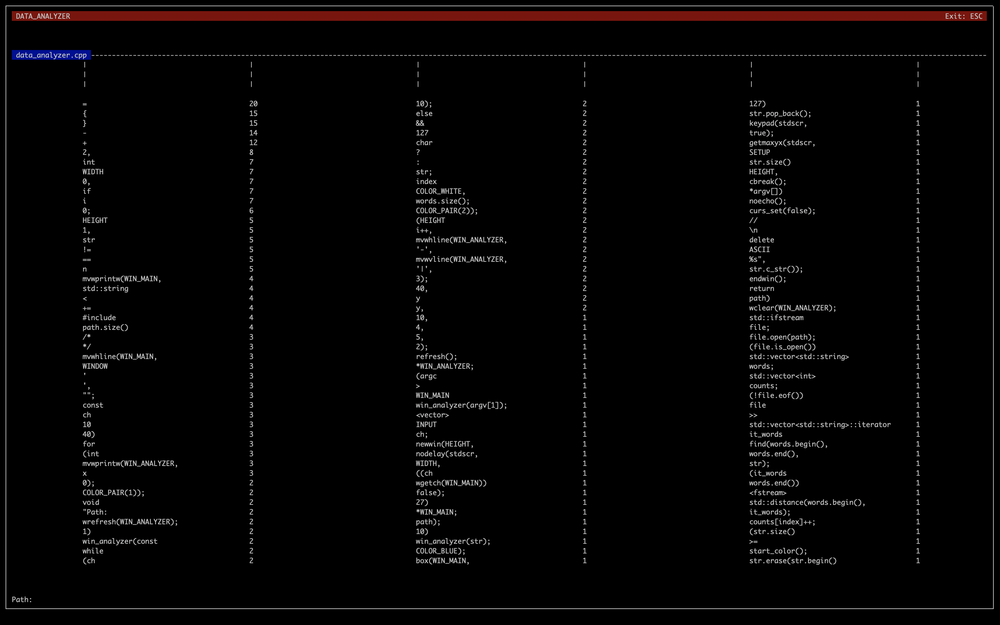
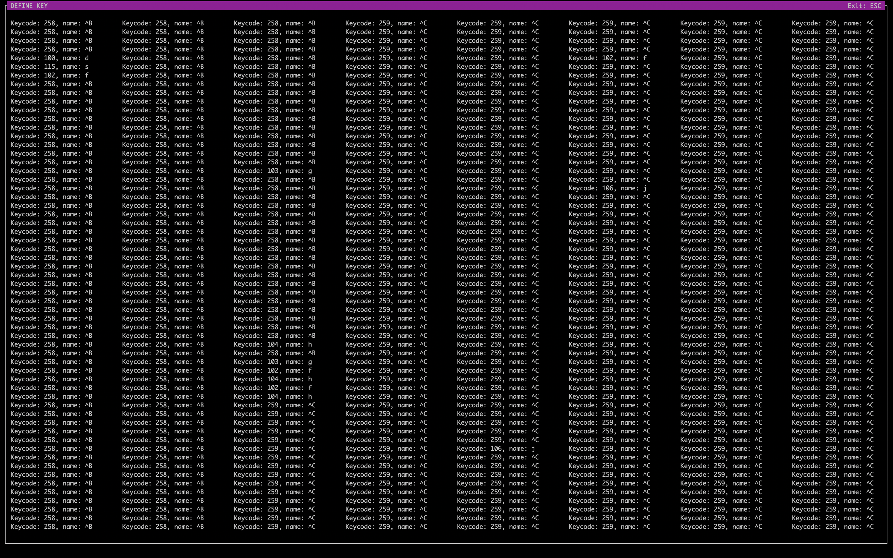
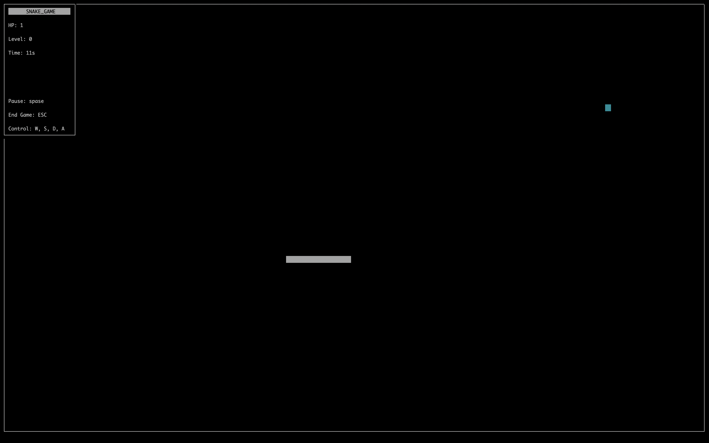

# Min Porgrams C/C++

This repository contains small applications written using C/C ++ and ncurses libraries such as:

- [Data Analyzer](#data-analyzer)
- [Define Key](#define-key)
- [Snake Game](#snake-game)

------------

## Data Analyzer

Analyzes files and lists the most and least used words or characters, sorts them in descending order. Uses C++ programming language and ncurses library.

## Define Key

Expects activity from input devices and translates to ASCII table. Uses C programming language and ncurses library.

## Snake Game

The main purpose of the game of snakes is to eat apples that accidentally appear on the map, if you get on yourself or the wall, the end of the game will come. Uses C programming language and ncurses library.

